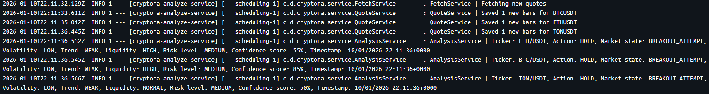
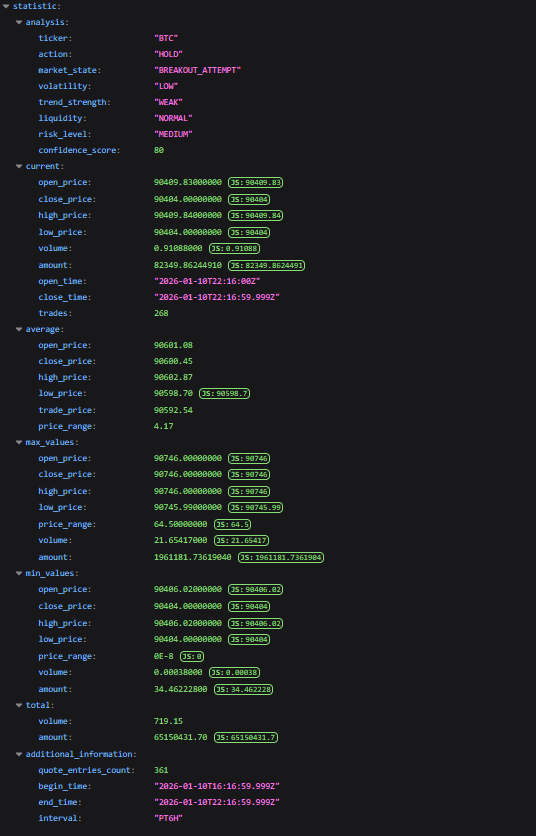
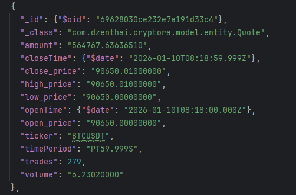

<div style="display: flex; flex-wrap: wrap; justify-content: center;">
    
</div>

## **Description**

**Cryptora** is a Spring Boot application that performs real-time technical analysis of cryptocurrency markets using
data from the Binance API. The service employs advanced technical indicators including Simple/Exponential Moving
Averages (SMA), Relative Strength Index (RSI), and Average True Range (ATR) to generate actionable trading signals
with comprehensive market state assessment.

---

## **Disclaimer**

**This service does not guarantee a 100% increase or decrease in cryptocurrency values.**
The service was developed solely by the author for educational purposes and should not be considered as financial
advice. The creator of this service is not responsible for any financial losses or damages incurred while using it.
Cryptocurrencies are highly volatile and carry inherent risks. Users should conduct their own research and consult with
a qualified financial advisor before making any investment decisions. By using this service, you acknowledge and accept
these risks.

---

## **Key Features**

- **Real-time Data Fetching**: Integrates with Binance API to retrieve live 1-minute candlestick data for multiple
  cryptocurrencies with automatic deduplication.

- **Historical Data Storage**: MongoDB stores complete price history, enabling comprehensive backtesting and trend
  analysis capabilities.

- **Advanced Technical Analysis**: Utilizes Ta4j library for professional-grade technical indicators:
    - **Moving Averages**: Configurable SMA periods for trend detection and crossover signals
    - **RSI (Relative Strength Index)**: Momentum oscillator with customizable overbought/oversold thresholds
    - **ATR (Average True Range)**: Volatility measurement with adaptive multipliers for dynamic threshold calculation

- **Multi-Dimensional Market Assessment**:
    - **Trading Signals**: BUY, SELL, HOLD recommendations based on technical indicator confluence
    - **Market State**: TRENDING, CONSOLIDATION, BREAKOUT_ATTEMPT classification
    - **Volatility Analysis**: LOW, MEDIUM, HIGH volatility categorization
    - **Trend Strength**: WEAK, MODERATE, STRONG trend evaluation
    - **Liquidity Assessment**: Volume-based liquidity scoring
    - **Risk Level**: Composite risk calculation (LOW, MEDIUM, HIGH)
    - **Confidence Score**: 0-100% confidence rating for each signal

- **Statistical Reports**: Detailed interval-based reports with current, average, min, max, and total metrics for
  comprehensive market overview.

- **Automated Scheduling**: Configurable scheduler with retry mechanism ensures continuous data collection and analysis
  every 60 seconds.

---

## **Technologies**

- **Java**: The primary programming language.

- **Spring Boot**: Framework used for building the service.

- **MongoDB**: A NoSQL database used for storing real-time cryptocurrency candles.

- **Docker**: Containerization platform that helps package the application with its dependencies, ensuring consistent
  environments and simplifying deployment.

---

## **Dependencies**

- **Spring Boot Starter Web 3.4.0**: RESTful web services framework with embedded Tomcat server for API endpoints

- **Ta4j 0.22.0**: Professional technical analysis library providing battle-tested indicators (SMA, RSI, ATR) and
  strategy framework

- **Binance Spot Connector 2.0.0**: Official Binance API client for accessing real-time market data and candlestick
  information

- **Spring Boot Starter Data MongoDB 3.4.0**: MongoDB integration with repository abstraction and document mapping for
  time-series data storage

- **Gson**: Google's JSON serialization/deserialization library for parsing API responses

- **Lombok**: Annotation processor reducing boilerplate code with @Data, @Builder, @Slf4j annotations

---

## **How it Works**

### **Technical Analysis Engine**

The application continuously fetches 1-minute candlestick data from Binance and applies multiple technical indicators to
generate trading signals. The analysis considers:

1. **Short-term vs Long-term Moving Average Crossovers**: Identifies trend changes when faster MA crosses slower MA
2. **RSI Momentum**: Filters signals based on overbought (>65) and oversold (<35) conditions
3. **ATR-based Thresholds**: Dynamic support/resistance levels adapted to current market volatility
4. **Volume Confirmation**: Requires above-average volume to validate breakout signals



In the example above:

The analysis service evaluates BTC, ETH, and TON in real-time, displaying:

- **Action**: Trading signal (BUY/SELL/HOLD)
- **Market State**: Current market phase
- **Volatility**: Price volatility level
- **Trend Strength**: Trend momentum assessment
- **Liquidity**: Current trading volume status
- **Risk Level**: Composite risk evaluation
- **Confidence Score**: Signal reliability percentage
- **Timestamp**: Analysis time in UTC

### **Statistical Reports API**

Access comprehensive market reports via REST endpoint:

```
GET http://localhost:8088/api/v1/report/ticker={ticker}&interval={interval}
```

**Parameters**:

- `ticker`: Cryptocurrency symbol (btc, eth, ton)
- `interval`: Time window (e.g., 1h, 6h, 1d, 7d)



**Response includes**:

- **Analysis**: Current trading signal with market assessment
- **Current**: Latest OHLCV data and trade count
- **Average**: Mean values for price, volume, and trade price (VWAP-like)
- **Max/Min**: Extremum values within the interval
- **Total**: Cumulative volume and amount
- **Info**: Metadata including candle count, time range, and interval duration

### **Storing cryptocurrency data in a MongoDB**

After successfully retrieving data from the Binance API, all cryptocurrency information is stored in MongoDB.



In the example above:

**Fields**:

- **symbol**: Trading pair symbol (e.g., BTCUSDT)
- **openTime/closeTime**: Bar start/end timestamps (ISO 8601)
- **openPrice/closePrice**: Opening/closing prices
- **highPrice/lowPrice**: High/low prices during the period
- **volume**: Base asset volume
- **amount**: Quote asset amount
- **trades**: Number of trades executed
- **timePeriod**: Duration of the candlestick (ISO 8601 duration)

---

## **Installation Guide**

### **Prerequisites**

- Java 23
- Gradle 8.14
- Docker 29.1.3

### **Installation and Startup Steps**

1. **Clone the Repository**
   ```bash
   git clone https://github.com/dzenthai/cryptora.git
   cd cryptora
   ```

2. **Add Environment Variables**
   Before setting environment variables, make sure your Binance account is verified,
   as this is required to obtain the API_KEY and API_SECRET.

   You can obtain the API key and secret by following this [link](https://www.binance.com/my/settings/api-management).

   Create an .env file and add the required environment variables such as the Binance API key and secret.


3. **Build the Project Using Gradle**
   ```bash
   ./gradlew build
   ```

4. **Run the Application Using Docker**
   ```bash
   docker-compose up --build
   ```

---

## **Configuration**

### **Technical Indicator Parameters**

Edit `application.yaml` to customize analysis behavior:

```yaml
cryptora:
  short:
    time:
      period: 5      # Short-term MA period (minutes)
  long:
    time:
      period: 15     # Long-term MA period (minutes)
  atr:
    period: 14       # ATR calculation period
    multiplier: 1.5  # Threshold multiplier (lower = more signals)
  rsi:
    period: 9        # RSI calculation period
    overbought: 65   # RSI overbought threshold
    oversold: 35     # RSI oversold threshold
```

**Recommended Settings for 1-minute Timeframe**:

- Shorter periods (5/15) for faster reaction to crypto volatility
- RSI period of 9 instead of standard 14 for quicker momentum detection
- ATR multiplier of 1.5 optimized for cryptocurrency volatility patterns
- Overbought/Oversold thresholds at 65/35 to avoid extreme noise

### **Adding New Cryptocurrencies**

Update the `Asset` enum in `model/enums/Asset.java`:

```java
public enum Asset {
    BTC,
    ETH,
    TON,
    // Add more supported pairs here
}
```

**Note**: All tickers are automatically suffixed with "USDT" to form trading pairs (symbols).


### **Adjusting Fetch Interval**

Modify scheduler frequency in `job/AppScheduler.java`:

```java

@Scheduled(fixedRate = 60000) // 60000ms = 1 minute
public void executeInSequence() {
    // Fetch and analyze data
}
```

**Warning**: Setting intervals below 60 seconds may trigger Binance API rate limits.

### **Historical Data Limit**

Adjust initial data fetch size in `service/FetchService.java`:

```java
ApiResponse<KlinesResponse> klinesResponse = spotRestApi.klines(
        symbol,
        Interval.INTERVAL_1m,
        null,
        null,
        "+0",
        500  // Number of historical candles (max: 1000)
);
```